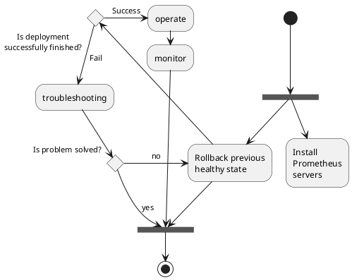

# Ansible Role: Prometheus

Self-managing role for maintain **Prometheus** instance/cluster. The role
including automation scripts to the whole operation lifecycle.




## Status

[](https://travis-ci.org/lordoftheflies/prometheus_role)

## Description

The `prometheus_role` is an Ansible role used to setup and maintain production grade services,
including the whole operation lifecycle.

## Roadmap

* [ROADMAP.md](ROADMAP.md)

## References

* [docs.ansible.com](https://docs.ansible.com/)
* [On Ansible Galaxy](https://galaxy.ansible.com/lordoftheflies/prometheus_role)

## Requirements

### Production

* Ansible

### For Local Testing

* [Vagrant](https://www.vagrantup.com/) - (Tested using version 2.1.1)
* Vagrant plugins:
  * [vagrant-disksize (0.1.2)](https://github.com/lordoftheflies/vagrant-disksize)
  * [vagrant-libvirt](https://github.com/lordoftheflies/vagrant-libvirt)
  * vai (0.9.3) - For testing with multiple vms [vagrant-plugin-vai](https://github.com/lordoftheflies/vagrant-plugin-vai)
  * [vagrant-vbguest (0.15.2) - Recommended vagrant-vbguest](https://github.com/lordoftheflies/vagrant-vbguest)
* [Virtual Box](https://www.virtualbox.org/)
  * Tested using Version 5.2.14 r123301 (Qt5.6.1)

## Variables

### defaults/main.yml

* [defaults/main.yml](defaults/main.yml) contains all of the required variables.

### project_name/site.yml example

* [example_prometheus_role.yml](files/example_site.yml) may contain an example entry.

## Testing

To test with all VM's defined in Vagrantfile run the following:

```shell
cd roles/prometheus_role
vagrant up
```

To run on a specific VM's
```shell
vagrant up xenial
```

### VM's tested with Vagrant and Virtualbox

pass, fail, untested, unsupported


| OS | Version | Distribution | Supported [^1](#) | Results  |
| :--- | :---: | :---: | :---: | :---: |


## Authors

- [László Hegedűs](mailto:lordoftheflies)

## License: [MIT](https://tldrlegal.com/license/mit-license)

* prometheus_role generated using [ansible_collection_skeleton](https://github.com/lordoftheflies/ansible_collection_skeleton)
